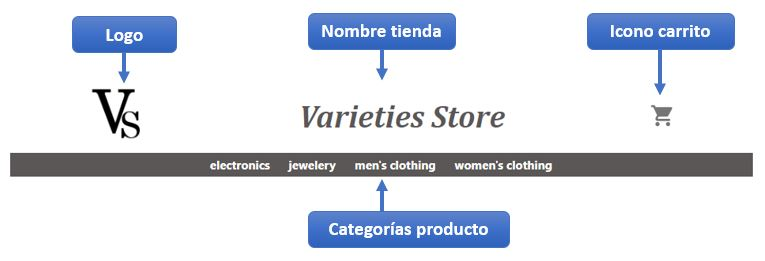
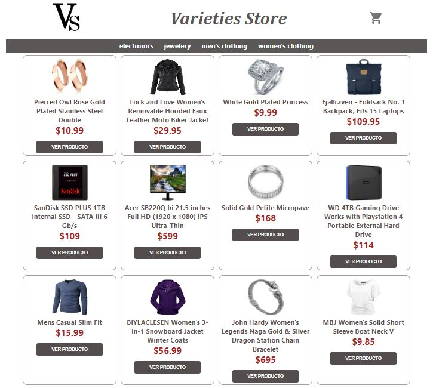
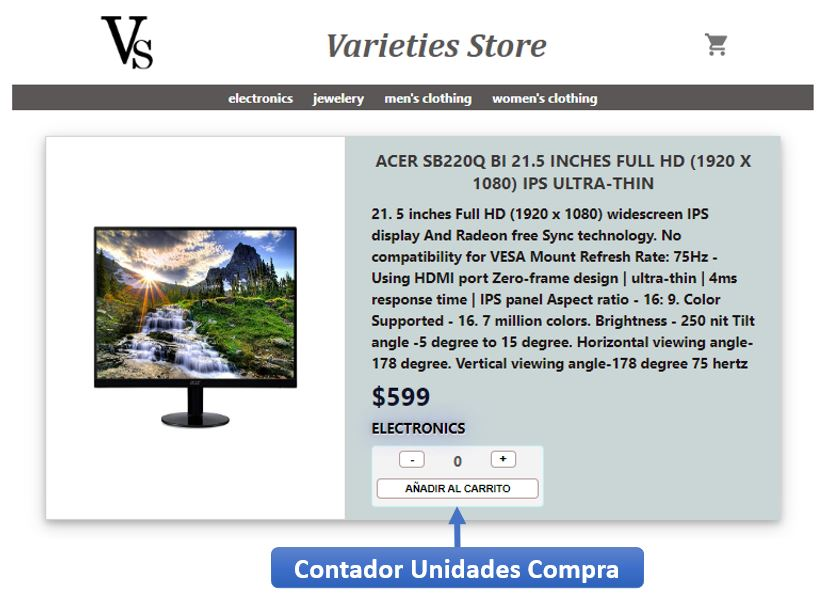
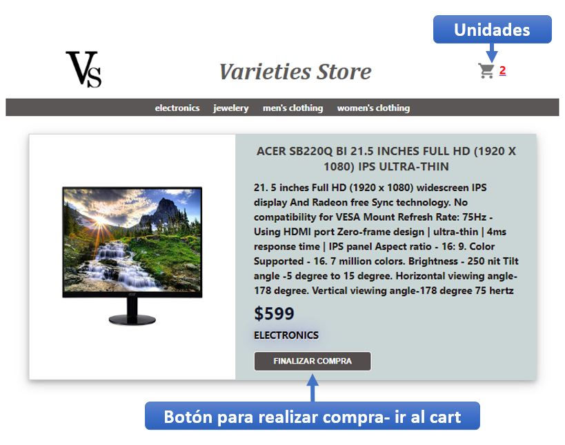
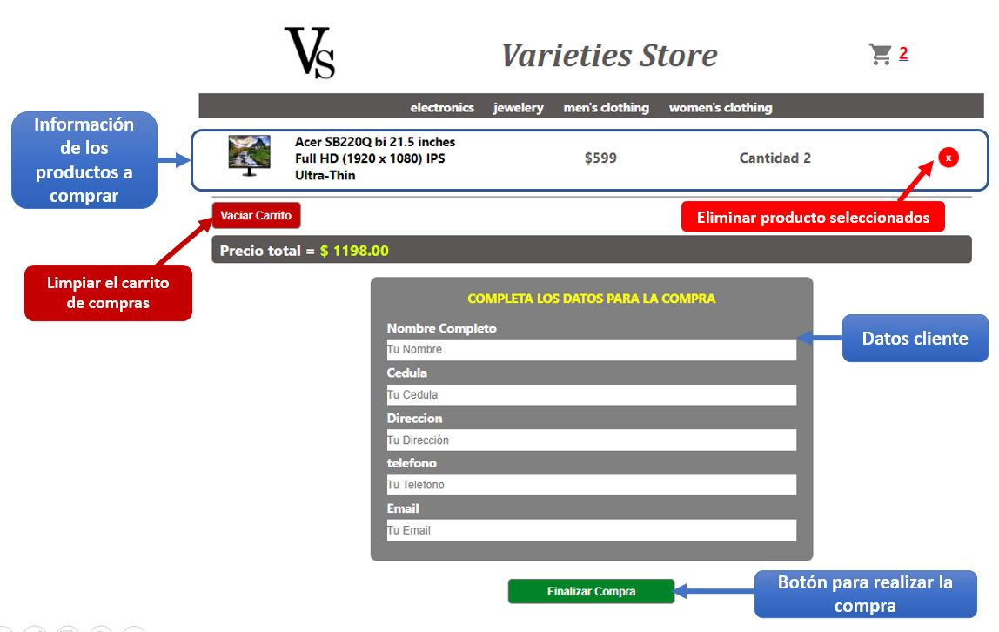
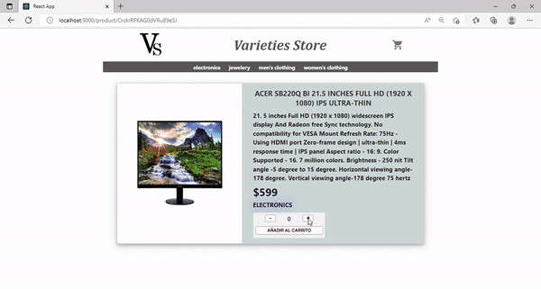

## Proyecto React - Ecomerce

###Descripcion

La pagina es un proyecto de un curso de React y se fue construyendo paso a paso conforme se iban aprendiendo los conceptos mas importantes de la tecnologia.

Cada que se veia un tema se hacia un ajuste o avance al proyecto.

>Temas vistos
>1. Instalación y configuración del entorno
>2. JSX & transpiling
>3. Componentes I
>4. Componentes II
>5. Promises, asincronía y MAP
>6. Consumiendo APIs
>7. Routing y Navegación
>8. Eventos
>9. Context
>10. Técnicas de rendering
>11. Utilizando Firebase
>12. Firebase II

###Creador

El proyecto fue trabajado Por Carlos Alberto Contreras, estudiante de la carrera de derrollo Fullstack en Coder House y fue su primer proyecto con la tecnologia React.

###Herramientas
Para el desarrollo de la aplicaion se usaron diferentes herramientas:

>* Editor de Codigo Visual Studio Code
>* Se uso la Api [fake Store Api](https://fakestoreapi.com/)
>* libreria [Sweet alert](https://sweetalert.js.org/)
>* libreria [Material UI icons](https://mui.com/)
>* Para la navegacion de la pagina se uso [React Router Dom](https://reactrouter.com/)
>* Para el CSS no se usaron librerias

###Funcionamiento de la Aplicacion

La plataforma funciona como una tienda de articulos varios donde se tiene una lista de productos que pueden ser seleccionados para su posterior compra.

La plicacion cuenta con una barra de navegacion donde esta el tirulo de la tienda, el logo, el icono del carrito de compras y las categorias por producto.

 
#### Uso de la aplicacion paso a paso
-----

##### 1- Lista de productos:
Los articulos disponibles estan en la pagina principal con su imagen de referencia y algunos datos de descripcion.
desde esta vista previa se puede seleccionar el producto deseado para ver una informacion mas detallada del articulo.

##### 2- Detalle del producto:

Una vez se ingresa al producto seleccionado, se puede ver mas informacion del articulo y ademas se puede seleccionar la unidades de compra del producto.

Al añadir los productos al carrito, la cantidad se muestra en el icono del Cart y me aparece un boton para proceder con la compra e ir a la ventana principal del cart.

##### 3- Detalle de la compra - contenido del Cart:

Una vez seleccionado los productos, la aplicacion direcciona al contenido del carrito de compras donde se puede ver informacion consolidada y se tienen varias funcionalidades.

* Precio total
* Cantidad seleccionada
* Imagen en miniatura del producto
* Formulario para datos del cliente (no funcional en esta aplicacion)
* Boton para vaciar el carrito si queremos cancelar la compra
* cada producto tienen un boton de eliminar si se quiere descartar algun articulo de la compra
* Boton de finalizar compra, para completar el proceso de la compra. 

> En esta seccion del cart, el usuario puede ir a buscar otros productos y adicionarlos al carrito si desea agrandar la compra. 

Una vez se realiza la compra aparece una alerta con el id de la venta

 

----
**Simulacion De la Pagina**

